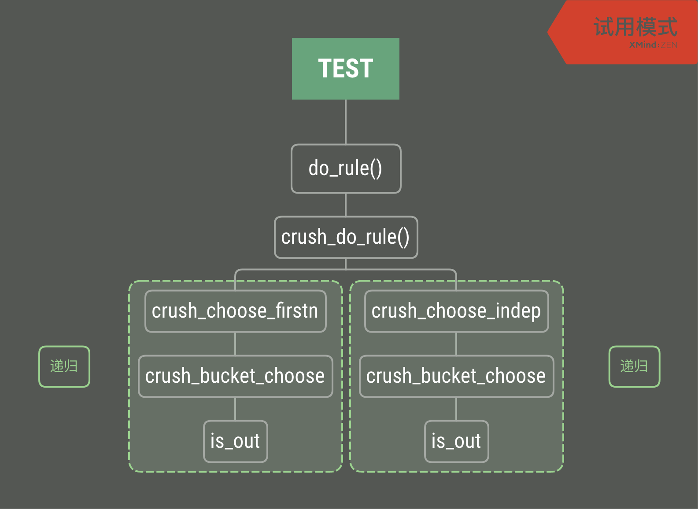

 
#  CRUSH Overview

Controlled Replication Under Scalable Hashing

##  解决的问题 

1. 存储设备数量变化，且异构的存储设备（ 数据迁移 ）
2. 数据备份（ 可靠性）

##  CRUSH算法 

### straw2算法 
- 输入：数据唯一标志符（pg_id），存储拓扑（crush map），数据备份策略（placement rule）
- 时间复杂度：O(*N*)，但是抵御结构变化的能力好。
- 与straw相比，straw2计算签长时仅使用自身长度。

### cluster map
- ceph集群拓扑的逻辑描述：
	
	root --> bucket *X n* --> device,device也可以抽象为一个bucket

- 每个节点拥有一个唯一的数字ID，只有叶节点（device）有非负的数字ID。

### placement rule，数据分布策略
三个操作：

1. take：从cluster map中选择指定的bucket
2. `select(pg_id, cluster map, rule)`：从输入的bucket中随机选择指定类型和数量的items
   - 备份策略：多副本 & 纠删码
   - 相应算法：firstn & indep
3. emit：输出选择结果给上级调用并返回

##  CRUSH Code 

### test framework
- [google test](https://github.com/google/googletest)
- [gtest 简单教程](http://senlinzhan.github.io/2017/10/08/gtest/)

### crush调用关系
CRUSH test 入口

### 容灾域判断入口
1. `crush_choose_firstn()`:

		if (itemtype != type) {
			if (item >= 0 ||
			    (-1-item) >= map->max_buckets) {
				dprintk("   bad item type %d\n", type);
				skip_rep = 1;
				break;
			}
			in = map->buckets[-1-item];
			retry_bucket = 1;
			continue;
		}
		

2. `crush_choose_indep()`: 此函数和`crush_choose_firstn()`的区别是，`crush_choose_indep()`总是返回固定长度的结果，其中的空位置用`CRUSH_ITEM_NONE`填充

		/* keep going? */
		if (itemtype != type) {
			if (item >= 0 ||
			    (-1-item) >= map->max_buckets) {
				dprintk("   bad item type %d\n", type);
				out[rep] = CRUSH_ITEM_NONE;
				if (out2)
					out2[rep] =
						CRUSH_ITEM_NONE;
				left--;
				break;
			}
			in = map->buckets[-1-item];
			continue;
		}

##  cushtool 

0. 获取ceph集群的crush map:
	
	`ceph osd getcrushmap -o map`

1. 创建crush map：

	`crushtool -o {compiled-file-name} --build --num_osds 27 host straw2 3 rack straw2 3 root uniform 0`
	
2. 显示map

	`crushtool -i {compiled-file-name} --tree`

3. 反编译map

	`crushtool -d {compiled-file-name} -o {decompiled-file-name}`

4. 编译map

	`crushtool -c {decompiled-file-name} -o {compiled-file-name}`

5. 测试

	`crushtool -i map --test --min-x 0 --max-x 8 --num-rep 3 --ruleset 0 --show_mappings/show_utilizaiton`
	- min-x: start of the input range 
	- max-x: end of the input range 
	- num-rep: 副本个数
	- ruleset: 选择的rule编号
	- show_mappings: 展示map结果
	- show_utilization: 展示结果的分布状况